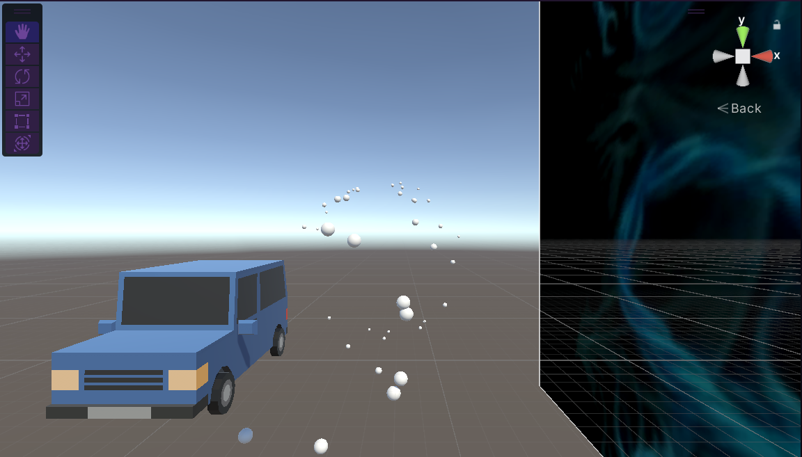

# BulletHellShooter_A01709338

    TC2008B
    Jorge Emiliano Pomar A01709338
    Fecha de entrega: 02/06/2024

## Índice

1. [Planteamiento del problema](##problema)

2. [Desarrollo](##desarrollo)

   - [Player](###player)
   - [Bullets](###bullets)

3. [Resultados](##resultados)

4. [Conclusiones](##conclusiones)

5. [Referencias](##referencias)

## Planteamiento del problema

Durante las ultimas dos semanas, empecé con el desarrollo gráfico y de scripts para juegos en Unity. Desde el primer laboratorio en el que se pedía un juego multijugador para una simulación de un coche hasta el útlimo laboratorio que hice previo a esta actividad que se trataba de interactuar con los text Mesh Pro para desplegar información de manera dinámica en la pantalla.

Ahora que ya tenía lo básico de manejo de la cámara, creación de objetos, manejo de scripts, y creacion de text mesh pro, se me pidió que creara un juego al estilo de un Bullet Hell Shooter. Estos juegos tienen la característica de tener una cantidad ridícula de balas desplegandose por todos lados de la pantalla. Y el jugador, en lo más mínimo, tiene que hacer su mejor esfuerzo para esquivar las balas.

Considerando lo que és la base para estos juegos, el reto además de acabar un juego en una semana, es hacer que el bullet hell tenga al menos 3 patrones de disparar las balas. Además, la información de la cantidad de balas tiene que ser desplegada en la pantalla y el jugador se tiene que poder mover para esquivar las balas del jefe final. Y sobre todo, el juego tiene que cuidar que las balas que salgan de la vista del jugador se desactiven para no consumir recursos demás.

## Desarrollo

Así que empecé el proyecto en unity 3d e hice un canvas con un fondo al cual la cámara principal estaría apuntando. Después empecé a crear los sprites. Primero del jugador (en este caso un coche azul) y después el sprite del jefe (un tanque de guerra) y por último el sprite de las balas (una esfera normal 3d). Una vez que tenía los sprites, empecé a crear los scripts para cada uno.

- ### Player
  El primer script PlayerMovement.cs recibe de input la tecla de flecha izquierda, flecha derecha y flecha arriba para mover el coche. El coche se mueve de lado a lado y hacia adelante. Igualmente acepta datos de la velocidad del coche y la velocidad para voltearse. Al final, el jugador representado por el coche azul, puede moverse por la pantalla para esquivar las balas como se muestra en la imagen.


- ### Bullets

Para las balas, como se tenía que hacer varios patrones, empecé por elegir un sprite de una esfera 3d, y a este sprite le puse un script Bullet.cs que se encarga de instanciar la bala en la posición del tanque y darle una velocidad en dirección al jugador. Además, con la función en Start() de Quaternion Euler pude hacer que las balas se rotaran dandole parametros de x, y, z.

```csharp
    void Start()
    {
        timer = lifeTime;
        transform.rotation = Quaternion.Euler(1, 1, rotation);
    }
```

Posteriormente, en el mismo script, se le da una velocidad a la bala en dirección al jugador en Update(). Y por último, se utiliza el OnEnable() para revivir la bala y poder volver a reutilizarla cuando vuelve a la cola de objetos en el pooling que se hizo para el juego.

Para el pooling tenemos en primera instancia el script de BulletList.cs que primero se encarga de crear el arreglo de balas. Después va iterando sobre ese arreglo para encontrar las balas que en ese momento del juego están inactivas o están fuera de la cámara. Si es así, entonces activa las balas y las vuelve a poner en la cola de balas. De esta manera se recilcan las balas. Caso contrario, si se ecnuentra que todas las balas están inactivas, entonces se regresa null para que el siguiente script que voy a explicar pueda crear más balas.

```csharp
public class BulletList : MonoBehaviour
{
    public static List<GameObject> bullets;

    void Start()
    {
        bullets = new List<GameObject>();
    }

    public static GameObject GetBulletList()
    {
        for (int i = 0; i < bullets.Count; i++)
        {
            if (!bullets[i].activeInHierarchy)
            {
                bullets[i].GetComponent<Bullet>().OnEnable();
                bullets[i].SetActive(true);
                return bullets[i];
            }
        }
        return null;
    }
}
```

Por último, tenemos el script más extenso que es el de BulletSpawner.cs. Este script hace muchas cosas, y por eso está ligado directamente al objeto vacío creado para representar las balas.

Primero que nada, se tiene el GameObject de bullet spawner que recibe los patrones definidos del disparo de las balas y se basa en el input de la variable global de número de balas para crear las balas en la posición Quaternion de 0,0,0 y las guarda en el arreglo de las balas para el pooling. A cada bala se le asigna el valor definido en el input de velocity, velocidad de disparo (speed) y número de rotaciones. Las balas se crean con el método de "Instantiate" que sirve para instanciar objetos de tipo GameObject.

```csharp
    public GameObject[] SpawnBullets()
    {
        rotations = Patterns();

        GameObject[] bullets = new GameObject[numBullets];
        for (int i = 0; i < numBullets; i++)
        {
            bullets[i] = BulletList.GetBulletList();
            if (bullets[i] == null)
            {
                bullets[i] = Instantiate(bulletPrefab, transform.position, Quaternion.identity);
                bullets[i].transform.localPosition = Vector3.zero;
            }

            var b = bullets[i].GetComponent<Bullet>();
            b.rotation = rotations[i];
            b.speed = bulletSpeed;
            b.velocity = bulletVelocity;
        }
        BulletCountUpdate(numBullets);
        return bullets;
    }

```

Para definir los patrones que hacen las balas, primero que nada se hizo un método Patterns() el cuál se encarga de alternar los patrones de manera ordenada durante el juego cada 10 segundos. Los patrones que cree para el juego son los siguientes:
1. **Circle Pattern** - Se divide el circulo (360 grados) entre el número de balas y se le asigna un ángulo a cada bala. De esta manera, las balas salen en forma de circulo alrededor del tanque hacia el coche azul. 

```csharp
    public float[] CirclePattern()
    {
        float angle = 360.0f / numBullets;
        for (int i = 0; i < numBullets; i++)
        {
            rotations[i] = angle * i;
        }
        return rotations;
    }
```

2. **Spiral Pattern** - Aquí se tiene la variable de currentSpiral que va a almacenar los ángulos de rotación de cada bala. En cada iteración, a cada bala se le aumenta la velocidad y el angulo de rotación para que las balas salgan cada vez más desfasadas. Y así se hace un efecto de espiral. 
    
    ```csharp
    public float[] SpiralPattern()
    {
        for (int i = 0; i < numBullets; i++)
        {
            rotations[i] = currentSpiral + (i * spiralSpeed);
            rotations[i] = Mathf.Repeat(rotations[i], 360.0f);
        }
        currentSpiral += spiralSpeed;
        return rotations;
    }
    ```

3. **DirectPattern** - Este patrón no sale en línea recta, pero los disparos son contantes hacia la misma dirección. La cosa es que aquí cada bala se le agrega el ángulo de rotación mínimo para que las balas salgan en una dirección diferente a la del tanque y de esta menera haga una figura en la pantalla con las balas. En este caso, definí el ángulo de 90 grados para que las balas salgan en forma de cruz o de cuadrado. Dependiendo cómo lo quieras ver. 


    ```csharp
    public float[] DirectPattern()
    {
        float angle = 90.0f;
        for (int i = 0; i < numBullets; i++)
        {
            rotations[i] = minRotation + (angle * i);
        }
        return rotations;
    }

    ```
4. **RandomPattern** - En este patrón use unity engine para que me diera números aleatorios que sirvieran para que los ángulos de rotación en las que sale cada bala fueran aleatorios. 

    ```csharp
    public float[] RandomPattern()
    {
        float[] randomRotations = new float[numBullets];
        for (int i = 0; i < numBullets; i++)
        {
            randomRotations[i] = Random.Range(minRotation, maxRotation);
        }
        return randomRotations;
    }
    ```
Por último, en este mismo script, se definen tres Text Mesh Pro para desplegar la info de las balas, el tiempo y el patrón que se está mostrando. Las balas se actualizan cada cinco segundos utilizando una Coroutine. En el caso del tiempo, el contador se inicializa al principio del juego justo cuando empieza la ejecución y nunca termina. Igualmente se utilizó una Coroutine. Y para la actualización del patrón, igualmente se utiliza una Coroutine para que cada diez segundos cambie de patrón y se actualice el número del patrón en pantalla. 

## Resultados


* ### [Video del juego](https://youtu.be/ZHZab8FKjRc?si=PSrmx_uurMY5gvjJ)

## Conclusiones

Los bullet hell shooters definitivamente se ven como un juego muy complejo de hacer en primera instancia por la cantidad de balas y la cantidad de movimientos que ocurren al mismo tiempo en la pantalla. Los ejemplos que me mostraron antes de emepzar se veían muy intimidantes. El juego que hice tiene áreas de oportunidad, definitivamente no es una representación fiel de los ejemplos. Aún así creo que aprendí mucho acerca del manejo de recursos gráficos. Y más que nada, aprendí como poder hacer cosas que parecen imposibles de manera dinámica con tan solo scripts que pueden crear objetos de manera dinámica. Y sobre todo poder reciclar todos los objetos para que el juego no sea muy pesado y mucha gente lo pueda jugar. Además, pude reforzas lo antes hecho en los laboratorios pasados para la creación de text mesh que se actualizan en tiempo real con información útil para el jugador. Y por último, pude reforzar el manejo de la cámara y la creación de prefabs para el juego.

## Referencias

Flick, J. (2021, 18 mayo). Mathematical surfaces. https://catlikecoding.com/unity/tutorials/basics/mathematical-surfaces/

SkyanSam - Skyrift Studios. (2020, 30 marzo). Coding a Bullet Hell Engine from Scratch in Unity : 1. The Core [Vídeo]. YouTube. https://www.youtube.com/watch?v=UZWEkpWgs-4

SkyanSam - Skyrift Studios. (2020b, mayo 28). Coding a Bullet Hell Framework in Unity : 2. Pooling, Parenting, Sequencing, Time, & more! [Vídeo]. YouTube. https://www.youtube.com/watch?v=ZQ8h7lM_BYY


